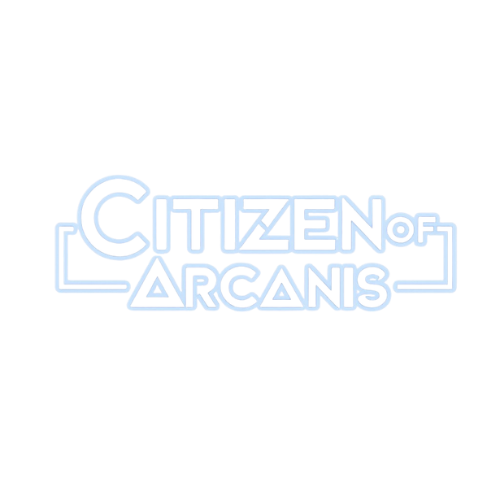

# 🚀 COA Marketplace - Cyberpunk Trading Platform

[](https://nextjs.org/)
[](https://reactjs.org/)
[](https://www.typescriptlang.org/)
[](https://tailwindcss.com/)

<div align="center">
  
  
  <h3>🌐 A futuristic cyberpunk marketplace for trading weapons, augmentations, and digital assets</h3>
  
  [📱 Live Demo](#) • [📖 Documentation](#features) • [🚀 Getting Started](#getting-started) • [🤝 Contributing](#contributing)
</div>

---

## ✨ Features

### 🛒 **Core Marketplace Functionality**
- **Advanced Item Catalog** - Browse weapons, augmentations, and special equipment
- **Smart Search & Filtering** - Find items by category, rarity, and price range
- **Shopping Cart System** - Add, remove, and manage items with local storage persistence
- **Secure Checkout Process** - Complete purchase flow with multiple payment methods
- **Real-time Notifications** - Get instant feedback on cart updates and purchases

### 🎮 **Gaming-Inspired Design**
- **Cyberpunk Aesthetics** - Dark theme with neon cyan accents and gaming borders
- **Responsive UI** - Optimized for desktop and mobile gaming experiences
- **Interactive Elements** - Hover effects, glitch text, and neon glow animations
- **Pixelated Graphics** - Retro gaming-style image rendering

### 🔧 **Technical Features**
- **TypeScript** - Full type safety and enhanced developer experience
- **Component Architecture** - Modular, reusable React components
- **Custom Hooks** - Optimized state management for marketplace operations
- **Local Storage Integration** - Persistent cart data across sessions
- **Modern CSS** - Tailwind CSS with custom cyberpunk design system

## 🚀 Getting Started

### Prerequisites

- **Node.js** 18.0 or higher
- **npm** or **yarn** package manager

### Installation

1. **Clone the repository**
   ```bash
   git clone https://github.com/your-username/coa-marketplace.git
   cd coa-marketplace
   ```

2. **Install dependencies**
   ```bash
   npm install
   # or
   yarn install
   ```

3. **Start the development server**
   ```bash
   npm run dev
   # or
   yarn dev
   ```

4. **Open your browser**
   ```
   http://localhost:3000
   ```

### Build for Production

```bash
npm run build
npm start
```

## 🏗️ Project Structure

```
coa-marketplace/
├── 📁 public/                    # Static assets
│   ├── 📁 assets/               # Item images and graphics
│   ├── 📁 items/                # Product images
│   └── 🖼️ citizen-logo.png      # Brand logo
├── 📁 src/
│   ├── 📁 app/                  # Next.js app directory
│   │   ├── 🎨 globals.css       # Global styles and design system
│   │   ├── ⚛️ layout.tsx        # Root layout component
│   │   └── 🏠 page.tsx          # Main marketplace page
│   ├── 📁 components/           # React components
│   │   ├── 📁 cards/            # Product and item cards
│   │   ├── 📁 common/           # Reusable UI components
│   │   ├── 📁 filter/           # Filtering components
│   │   ├── 📁 marketplace/      # Marketplace-specific components
│   │   └── 📁 ui/               # Base UI components
│   ├── 📁 data/                 # Mock data and constants
│   ├── 📁 hooks/                # Custom React hooks
│   ├── 📁 lib/                  # Utility libraries
│   ├── 📁 types/                # TypeScript type definitions
│   └── 📁 utils/                # Helper functions
├── ⚙️ tailwind.config.ts        # Tailwind CSS configuration
├── 📦 package.json              # Dependencies and scripts
└── 📚 README.md                 # Project documentation
```

## 🎨 Design System

### Color Palette
- **Primary**: Cyan Blue (`hsl(180, 100%, 70%)`) - Signature Arcanis color
- **Background**: Dark (`hsl(0, 0%, 8%)`) - Deep space black
- **Accent**: Bright Cyan (`hsl(180, 100%, 50%)`) - Interactive elements
- **Text**: Light Grey (`hsl(0, 0%, 95%)`) - High contrast readability

### Typography
- **Display Font**: Orbitron - Futuristic headings and titles
- **Mono Font**: Share Tech Mono - Technical text and UI elements

### Visual Effects
- **Neon Glow**: CSS box-shadow effects for interactive elements
- **Cyberpunk Borders**: Animated gradient borders on hover
- **Pixelated Images**: Retro gaming-style image rendering

## 🛠️ Technologies Used

| Technology | Version | Purpose |
|------------|---------|---------|
| **Next.js** | 15.4.4 | React framework with App Router |
| **React** | 19.1.0 | UI component library |
| **TypeScript** | 5.0+ | Type-safe JavaScript |
| **Tailwind CSS** | 3.4.17 | Utility-first CSS framework |
| **Framer Motion** | 12.23.9 | Smooth animations and transitions |
| **Radix UI** | Latest | Accessible component primitives |
| **Lucide React** | 0.526.0 | Modern icon library |

## 📁 Key Components

### 🏪 **Marketplace Components**
- `page.tsx` - Main marketplace interface with item grid and filters
- `ItemDetailModal.tsx` - Detailed item view with stats and purchase options
- `CheckoutModal.tsx` - Complete checkout process with payment methods
- `NotificationSystem.tsx` - Real-time user feedback and alerts

### 🛒 **Shopping Features**
- `useShoppingCart.ts` - Cart state management hook
- `useMarketplaceFilters.ts` - Search and filter functionality
- `marketplace-data.ts` - Mock product data and categories

### 🎮 **UI Components**
- `Navigation.tsx` - Cyberpunk-styled navigation bar
- `Footer.tsx` - Site footer with brand information
- Custom form controls with gaming aesthetics

## 🔮 Future Enhancements

- [ ] **User Authentication** - Account creation and login system
- [ ] **Inventory Management** - Personal item collection and trading
- [ ] **Blockchain Integration** - NFT support for unique items
- [ ] **Real-time Trading** - Live marketplace with websockets
- [ ] **Payment Gateway** - Integration with actual payment processors
- [ ] **Advanced Analytics** - User behavior and marketplace insights
- [ ] **Mobile App** - React Native companion application

## 🤝 Contributing

We welcome contributions to the COA Marketplace! Here's how you can help:

1. **Fork the repository**
2. **Create a feature branch** (`git checkout -b feature/amazing-feature`)
3. **Commit your changes** (`git commit -m 'Add amazing feature'`)
4. **Push to the branch** (`git push origin feature/amazing-feature`)
5. **Open a Pull Request**

### Development Guidelines

- Follow the existing code style and conventions
- Write TypeScript with proper type definitions
- Test components thoroughly before submitting
- Update documentation for new features
- Maintain the cyberpunk aesthetic and design system

## 📄 License

This project is licensed under the MIT License - see the [LICENSE](LICENSE) file for details.

## 👨‍💻 Development Commands

```bash
# Development server with Turbopack
npm run dev

# Production build
npm run build

# Start production server
npm start

# Run ESLint
npm run lint
```

## 🌟 Acknowledgments

- **Cyberpunk 2077** - Design inspiration for the futuristic aesthetic
- **Gaming Community** - Feedback and feature suggestions
- **Open Source Libraries** - Amazing tools that make this project possible

---

<div align="center">
  <p><strong>Built with ❤️ for the cyberpunk gaming community</strong></p>
  <p>🚀 <em>Trade everything. Your legend awaits.</em> 🚀</p>
</div>
